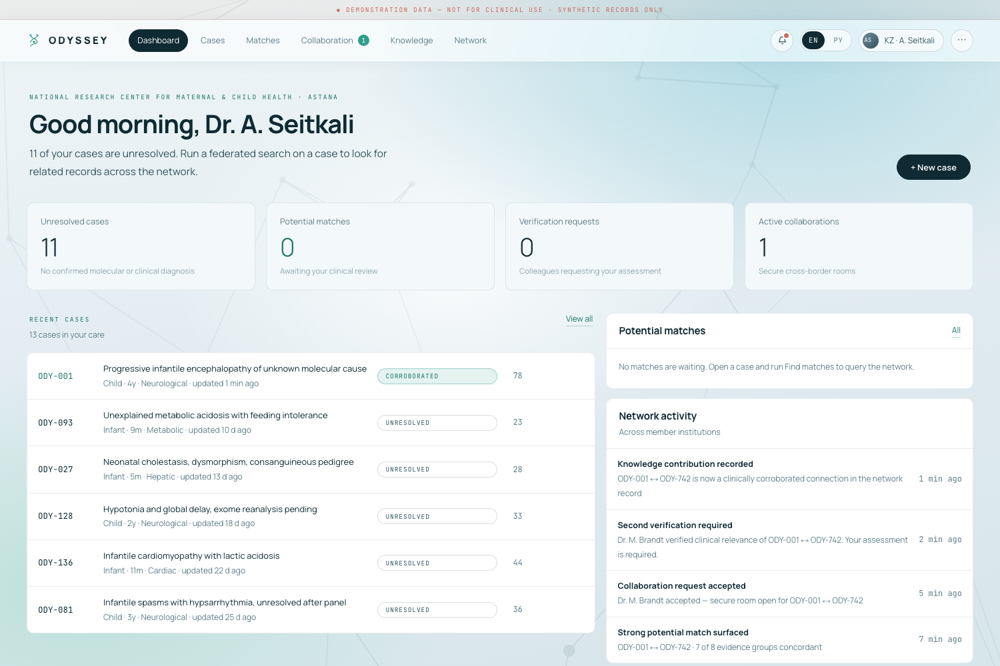
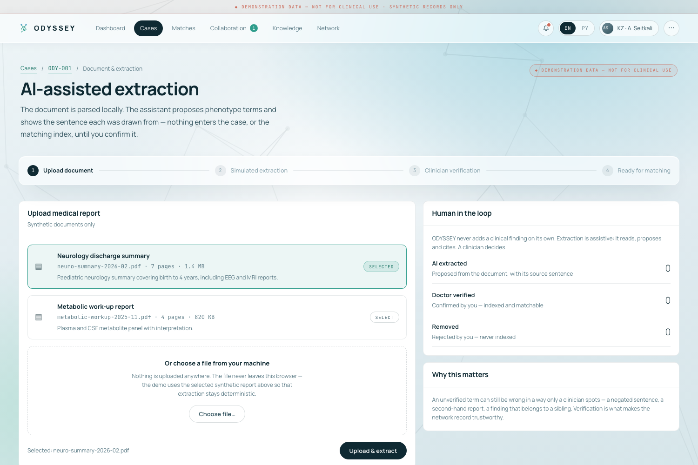
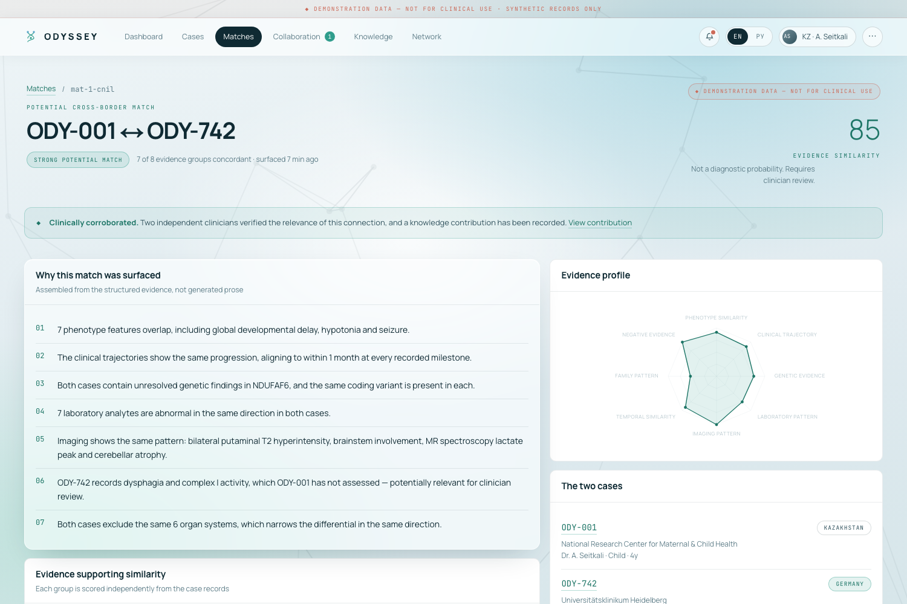
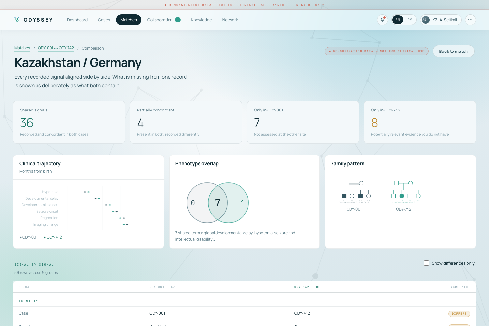
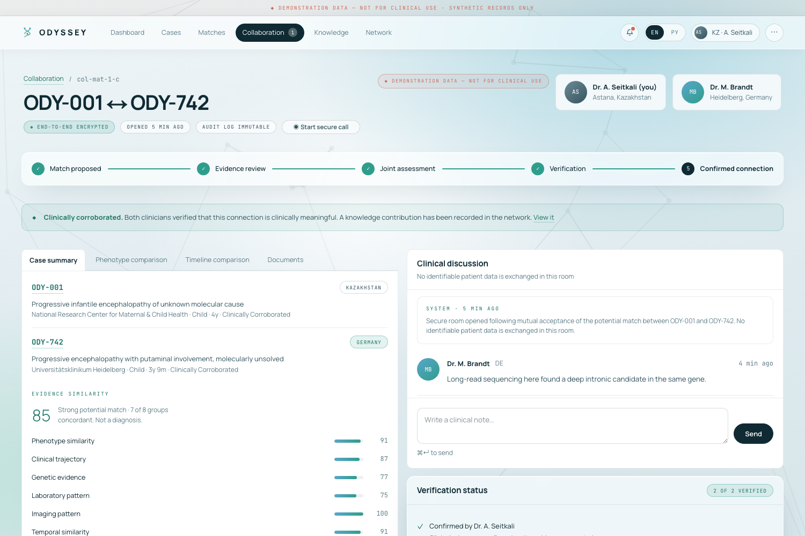
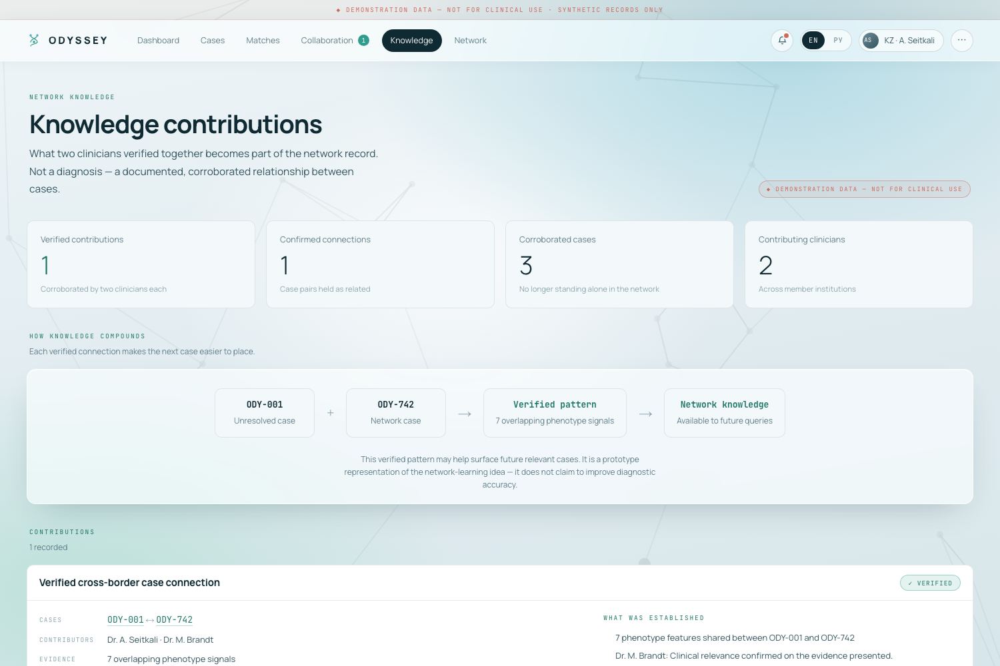
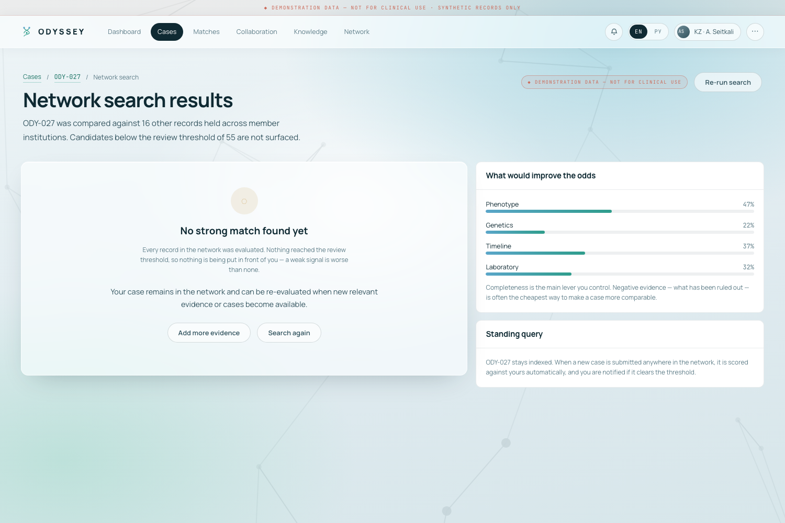
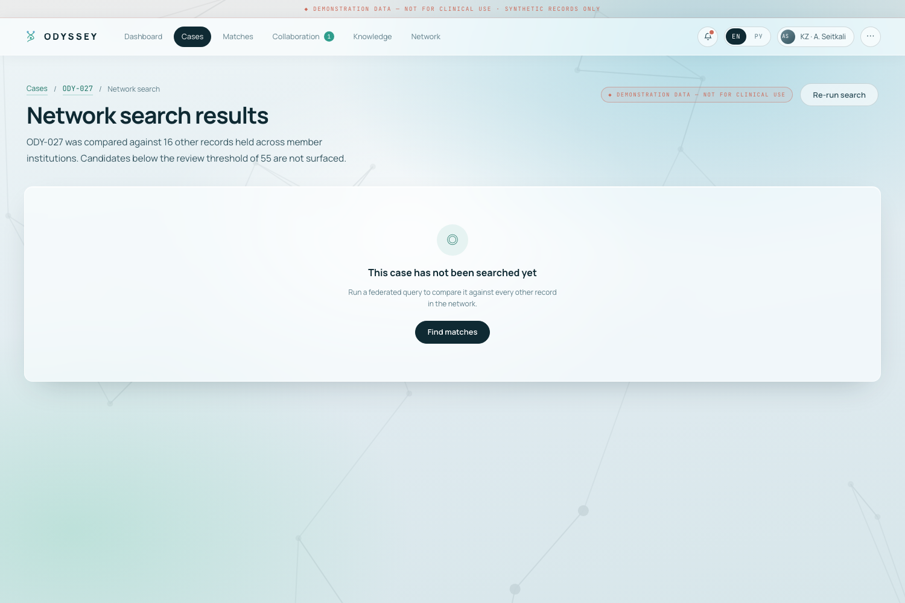

<div align="center">

# ODYSSEY

### Global Rare Disease Match Network

**The answer may already exist.**

*Somewhere, this was seen before.*

[**Live demo →**](https://odyssey-rd-network.vercel.app)
&nbsp;·&nbsp;
[Documentation](#documentation)
&nbsp;·&nbsp;
[What actually works](#current-p0--what-actually-works)
&nbsp;·&nbsp;
[Limitations](docs/LIMITATIONS.md)


</div>

---

> ### ⚠ DEMONSTRATION DATA — NOT FOR CLINICAL USE
>
> Every case, clinician, institution, variant, laboratory value and score in this application is
> **synthetic**. No real patients, clinicians, institutions or genomic results are represented.
>
> **ODYSSEY is not a diagnostic system.** It does not diagnose, does not prescribe, and does not
> replace a clinician. It surfaces *potential* similarity between recorded clinical evidence and
> hands that to a qualified specialist to interpret.
>
> This repository is a **P0 prototype**. Document extraction is **simulated**. The matching
> weighting is a **product simulation**, not a clinically validated method. There is no production
> backend, database, authentication or clinical validation. See
> **[docs/LIMITATIONS.md](docs/LIMITATIONS.md)**.

---

## What is ODYSSEY?

A rare clinical case should not stay isolated.

A similar case may already exist — in another clinic, another city, another country, another health
system, a published paper, a specialist registry, or in the memory of one other physician who saw
something like it years ago. The information exists. What is missing is the **connection** between
that information and the new case in front of a doctor today.

ODYSSEY is being built as a network that helps clinicians:

1. represent a difficult case as **structured clinical evidence**, not free-text prose;
2. find **potentially similar** cases elsewhere in the network;
3. understand **why** two cases were matched, evidence group by evidence group;
4. hand that potential connection to a **clinician for verification**;
5. **collaborate securely** with the clinician on the other side;
6. turn a confirmed connection into **structured knowledge** that improves future matching.

> **Не диагностируем пациента с нуля. Находим того, кто уже видел этот случай.**
> *We do not diagnose a patient from zero. We find the person who has already seen this case.*

---

## The problem

Rare disease creates a structural information problem — not a lack of intelligence, but a lack of
connection. Conceptually:

| | |
| --- | --- |
| **Few known cases** | Any single clinician may see a given rare presentation once in a career. |
| **Fragmented records** | Evidence about one condition is scattered across institutions and systems. |
| **Incompatible formats** | Discharge summaries, lab reports and genomic findings are recorded differently everywhere. |
| **No shared structure** | Without a common structured representation, two similar cases cannot be compared at all. |
| **Geographic separation** | The one specialist who recognises the pattern may be on another continent. |
| **Lost clinical experience** | Insight gained in one institution rarely reaches the next case elsewhere. |

The core problem is not that the answer is unknown. It is that **the answer may already exist and
is simply not connected to the new case.**

ODYSSEY's response is to turn that into a network effect:

```
Case A  +  Case B   →   new structured knowledge
Case A  +  Case B  +  Knowledge   →   a better chance of recognising Case C
```

---

## The core idea

```
Patient Case
   → Structured Clinical Profile
      → Global Matching
         → Explainable Similarity
            → Clinician Verification
               → Secure Collaboration
                  → Confirmed Knowledge
                     → Better Future Matching
```

Every arrow is a deliberate boundary. Nothing skips from *similarity* to *diagnosis*. The
verification step is the point where the system stops and a human decides.

---

## What ODYSSEY is **not**

ODYSSEY is **not**:

- a symptom checker;
- an autonomous diagnostic system;
- a generic chatbot;
- a medical forum;
- a simple rare-disease database;
- a crowdsourcing platform;
- a system that replaces clinicians;
- a system that independently prescribes or changes treatment.

The governing principle:

> ### AI inference ≠ clinical decision

AI's role is to structure information, surface potential connections, and explain why a similarity
was computed. The final clinical interpretation belongs to a qualified specialist. See
**[docs/MEDICAL_SAFETY.md](docs/MEDICAL_SAFETY.md)**.

---

## How it works

### Step 1 — Case creation · *implemented*

A clinician creates a case: `/cases/new`.

### Step 2 — Clinical information · *implemented (synthetic)*

A case can carry clinical signs and symptoms, age, symptom onset, symptom sequence, disease
trajectory, laboratory data, instrumental investigations, genetics, imaging, family history,
treatment history, treatment response, negative test results, and other relevant evidence. The
implemented field shapes are in [`src/store/types.ts`](src/store/types.ts) and documented in
[docs/DATA_MODEL.md](docs/DATA_MODEL.md).

### Step 3 — Structured representation · *implemented*

Information becomes a single structured profile. Phenotypes are HPO-coded, imaging findings are
feature codes, laboratory rows are analyte + matrix + value + flag. This is the point of the whole
product: **different documents from different systems have to end up in a form that can be
compared.** It is also why the interface can render the same case in English or Russian — structure
survives a border in a way that prose does not.

### Step 4 — AI-assisted extraction · **SIMULATED in P0**

> **Current prototype:** document extraction is **simulated**. No model is called. A fixed synthetic
> document maps to a fixed list of proposed terms, each carrying the sentence it was drawn from —
> [`src/store/extraction.ts`](src/store/extraction.ts).
>
> **Production vision:** real clinical document extraction and normalisation.

Extraction output is **never** treated as medical truth. Every proposed term arrives as
`verification: "unverified"` and enters the case only when a clinician confirms it. The clinician
can confirm, edit or reject each term, and low-confidence and negated candidates are flagged for
attention. The screen is labelled **SIMULATED AI EXTRACTION** throughout.

### Step 5 — Matching · *implemented, deterministic*

Eight independently computed evidence groups, each weighted. Real application logic, not a static
mock screen — see [Matching engine](#matching-engine).

### Step 6 — Explainable matching · *implemented*

A number alone is useless to a clinician. ODYSSEY shows **why**: which features overlap, what
differs, what is missing, and how much each evidence group contributed. See
[Explainable matching](#explainable-matching).

### Step 7 — Clinician verification · *implemented*

A potential match is handed to a specialist. Implemented match states are
`surfaced → dismissed | requested → declined | accepted → verified`, and implemented case states
are `Unresolved → Under review → Match proposed → Clinically Corroborated`.

> Some status names used in product discussions — *Potential Match*, *Strong Match*,
> *Clinician Review*, *Research Match*, *Confirmed Connection* — are **product concept / roadmap
> vocabulary**. The literal states implemented today are the ones listed above; the UI labels a
> surfaced match *Strong / Moderate / Weak potential match* based on score.

### Step 8 — Doctor collaboration · *implemented as an in-browser demo*

Once a connection is accepted, a collaboration room opens with the case evidence beside the
discussion, a decision log, shared documents and a simulated secure call panel.

> **This is a client-side demo, not a production secure collaboration backend.** There is no server,
> no transport encryption of clinical payloads, no identity provider and no access control beyond
> the demo clinician switcher. The production vision — secure rooms, consent-scoped access,
> server-side audit — is described in [docs/SECURITY.md](docs/SECURITY.md) and is **planned**.

### Step 9 — Knowledge contribution · *implemented (local state)*

When both clinicians have independently verified clinical relevance, a structured knowledge
contribution is recorded and both cases move to *Clinically Corroborated*.

```
Case A + Case B → Common Pattern → Knowledge → Case C
```

> **Knowledge compounds over time.** See [docs/KNOWLEDGE_NETWORK.md](docs/KNOWLEDGE_NETWORK.md).

---

## Current P0 — what actually works

| | |
| --- | --- |
| **Live demo** | <https://odyssey-rd-network.vercel.app> |
| **Repository** | <https://github.com/ha89ter-netizen/odyssey-rd-network> |
| **Stage** | P0 prototype — front-end only, synthetic data, browser-local state |
| **Reference commit** | `e77fd35` *(this README describes the repository at this commit)* |

The full story below runs end to end in a browser, and [`scripts/e2e.mjs`](scripts/e2e.mjs) asserts
every step of it (70 assertions, currently passing):

```
 1  Load the application                       /enter
 2  Enter as Dr Seitkali (Kazakhstan)          — no account, no password
 3  Create a case                              /cases/new
 4  Upload a report                            /cases/[id]/verify
 5  Simulated extraction proposes terms        SIMULATED AI EXTRACTION
 6  Clinician confirms / edits / rejects       each term individually
 7  Run the network search                     deterministic, in-browser
 8  ODY-742 (Germany) surfaces at 85/100       strong potential match
 9  Open "Why this match?"                     /matches/[id]
10  Compare the two cases                      /matches/[id]/compare
11  Request a clinical connection              with a note to the other clinician
12  Switch to Dr Brandt (Germany)              demo clinician switcher
13  Accept the connection                      collaboration room opens
14  Discuss with evidence alongside            /collaboration/[id]
15  Both clinicians verify relevance           dual, independent
16  Knowledge contribution recorded            /knowledge
```

Two further states are real application states, not mock screens:

- **No strong match** — running the search on `ODY-027` surfaces nothing. Verified engine output:
  `ODY-027 → 0 surfaced`, best candidate 37/100.
- **Not yet searched** — a case that has never been compared is tracked separately from a case that
  was compared and produced nothing (`state.searched`). Conflating the two would be a clinical
  safety problem, not a UI detail.

> **The matching engine is implemented as actual deterministic application logic, not a static mock
> screen.** The same pair always produces the same numbers, and the numbers are derived from the
> same structured fields the explanation is.

### Screenshots

Real screenshots of the running application, captured by
[`scripts/shot-app.mjs`](scripts/shot-app.mjs) driving the real flow:

| Doctor dashboard | Extraction review |
| --- | --- |
|  |  |

| Why this match | Case comparison |
| --- | --- |
|  |  |

| Collaboration room | Knowledge contribution |
| --- | --- |
|  |  |

The two negative states, which are real engine results rather than mock screens:

| No strong match found | Not yet searched |
| --- | --- |
|  |  |

---

## Matching engine

[`src/store/matching.ts`](src/store/matching.ts) — pure, deterministic, no randomness anywhere.

Eight evidence groups are computed independently from structured case fields and combined by weight:

| Evidence group | Derived from | Weight |
| --- | --- | ---: |
| **Phenotype similarity** | Jaccard over present HPO terms × severity concordance bonus | **22%** |
| **Genetic evidence** | Shared gene, identical variant, allele completeness, classification concordance | **18%** |
| **Clinical trajectory** | Milestone onset alignment within an 8-month window × event ordering | **16%** |
| **Laboratory pattern** | Analyte coverage × value proximity | **12%** |
| **Imaging pattern** | Jaccard over structured radiological feature codes | **12%** |
| **Temporal similarity** | First-abnormality proximity and length of the diagnostic course | **8%** |
| **Family pattern** | Consanguinity concordance and shared regional ancestry | **6%** |
| **Negative evidence** | Jaccard over canonicalised exclusions | **6%** |

> ⚠ **These weights are part of a product simulation. They are not a clinically validated medical
> model.** No clinical validation has been performed. A score expresses *similarity of recorded
> evidence between two cases* — it is not a diagnostic probability and carries no clinical claim.

**Thresholds**

| | |
| --- | --- |
| Display threshold | **55** — nothing below this is ever surfaced to a clinician |
| Strong potential match | **80+** |
| Moderate | 65–79 |
| Weak | below 65 (never surfaced, visible only in engine output) |

**Truncation, not rounding.** Every score passes through `Math.floor`. A score is never rounded up
to produce a more impressive-looking result. `pct = x => Math.floor(x * 100)`.

**Verified engine output** (reproduce with the script in [docs/TESTING.md](docs/TESTING.md)):

```
ODY-001 → 1 surfaced (threshold 55)
   ODY-742    85  strong
   ODY-128    31  weak
   ODY-556    27  weak
   dimensions: phenotype=91 trajectory=87 genetics=77 laboratory=75
               imaging=100 temporal=91 family=54 negative=100

ODY-027 → 0 surfaced (threshold 55)
   ODY-093    37  weak

deterministic: yes
```

---

## Explainable matching

Instead of only `85% match`, the match page assembles the reasons from the same computed facts that
produced the score:

**Why the cases are similar**
- 7 phenotype features overlap, including global developmental delay, hypotonia and seizure
- the clinical trajectories align to within 1 month at every recorded milestone
- both cases carry unresolved findings in the same gene, and the same coding variant
- 7 laboratory analytes are abnormal in the same direction
- imaging shows the same pattern across four structured features
- both cases exclude the same 6 organ systems

**What differs** — each evidence group scoring below the concordance line is reported as a
divergence, with its own summary.

**What is missing** — evidence recorded on one side and not the other is surfaced explicitly
(*"ODY-742 records dysphagia and complex I activity, which ODY-001 has not assessed"*), because a
gap in one record is a reason for clinician review, not a reason to lower a number silently.

The similarity score is never presented as a clinical probability. The match page states
*"Not a diagnostic probability. Requires clinician review."* next to the number.

---

## Architecture

```
          ┌─────────────────────────────────────────────┐
          │  UI  ·  app/ + src/ui + src/components      │
          │  routes, shell, primitives, visualisations  │
          └───────────────────┬─────────────────────────┘
                              │  dispatch(intent)
          ┌───────────────────▼─────────────────────────┐
          │  Domain state  ·  src/store/store.tsx       │
          │  reducer + React Context + audit trail      │
          └───────────────────┬─────────────────────────┘
                              │
          ┌───────────────────▼─────────────────────────┐
          │  Matching  ·  src/store/matching.ts         │
          │  Extraction  ·  src/store/extraction.ts     │
          │  Comparison  ·  src/lib/compare.ts          │
          │  pure, deterministic, side-effect free      │
          └───────────────────┬─────────────────────────┘
                              │
          ┌───────────────────▼─────────────────────────┐
          │  Synthetic data  ·  src/store/seed.ts       │
          │  17 cases · 2 clinicians · shaped like an   │
          │  API response, persisted to localStorage    │
          └─────────────────────────────────────────────┘
```

Full detail: **[docs/ARCHITECTURE.md](docs/ARCHITECTURE.md)**.

---

## Tech stack

Exactly what is in [`package.json`](package.json) — nothing else:

| | |
| --- | --- |
| **Next.js** | `^15.5.25` — App Router, route groups, static generation |
| **React** | `19.1.1` |
| **React DOM** | `19.1.1` |
| **TypeScript** | `^5.6.3` — strict |
| **Tailwind CSS** | `^4.1.13` via `@tailwindcss/postcss` |
| **playwright-core** | `^1.63.0` *(dev only — the test harness)* |
| **Persistence** | `localStorage` |

There are **three runtime dependencies**: `next`, `react`, `react-dom`. No state library, no UI kit,
no chart library, no backend SDK, no AI SDK, no database driver, no blockchain.

---

## Multilingual support

English and Russian, switchable from the header at any point.

| | |
| --- | --- |
| **UI dictionary** | **810 keys**, every one present in both languages (verified: 0 missing) |
| **Clinical content** | **245 strings** with a Russian rendering, keyed by the English source |
| **Persistence** | The choice is stored in `localStorage` under `odyssey.lang` |
| **Auto-detection** | A Russian `navigator.language` selects Russian on first load |

Structured clinical vocabulary renders in the reader's language — HPO terms, analytes, imaging
features, timeline events, genetics, treatment, negative evidence, statuses, notifications and audit
entries — because in the data model those are **codes, not text**.

**Engine-generated sentences are returned as a structured key plus data, never as a finished
string:**

```ts
// src/store/types.ts
export type Phrase = {
  key: string;                                  // "why.phenotype"
  params?: PhraseParams;                        // { n: 7 }
  lists?: Record<string, string[]>;             // clinical content to translate + join
  listsLower?: Record<string, string[]>;        // …lower-cased for mid-sentence grammar
};
```

Because of this, *"Why matched"*, notifications, the audit log and every other generated sentence
re-render correctly when the language changes — they are assembled in the active language rather
than translated after the fact. Russian's three plural forms are handled in
[`src/i18n/lang.ts`](src/i18n/lang.ts).

**Structured dictionary data is translated. Free clinician-authored text is preserved in the
language it was written in** — a discussion note or a verification note is clinical testimony, and
silently machine-translating it would be a safety problem.

---

## Responsive design

Every route is checked for layout overflow at three widths in both languages:

**15 routes × 3 widths (1500 / 1100 / 390 px) = 45 checks per language.**

Latest run: `SWEEP CLEAN — 45 checks` in English and `SWEEP CLEAN — 45 checks` in Russian.

---

## Testing

```bash
npm run build && PORT=4311 npm run start   # the tests drive a production build
npm run e2e                                # 70 assertions across the whole P0 flow
npm run e2e:ru                             # 19 checks on the Russian interface
npm run sweep                              # 45 responsive checks (English)
LANG_RU=1 npm run sweep                    # 45 responsive checks (Russian)
npm run typecheck                          # tsc --noEmit
```

**Verified results at commit `e77fd35`:**

| Command | Result |
| --- | --- |
| `npm run typecheck` | clean |
| `npm run build` | succeeds — 24 routes |
| `npm run e2e` | **70/70 — P0 FLOW PASSED**, 0 console errors |
| `npm run e2e:ru` | **19/19 — RUSSIAN UI PASSED**, 0 console errors |
| `npm run sweep` | **SWEEP CLEAN — 45 checks** |
| `LANG_RU=1 npm run sweep` | **SWEEP CLEAN — 45 checks** |

Both end-to-end suites fail the run on *any* console error. Detail:
**[docs/TESTING.md](docs/TESTING.md)**.

---

## Privacy by design

**Current prototype:** synthetic data only, no real patient data, `localStorage`, no production
medical backend, no clinical database, no authentication.

**Production architecture vision — planned, not implemented:** pseudonymisation, de-identification,
RBAC, consent management, server-side audit logs, encryption, minimum-necessary disclosure, secure
storage, secure clinician-to-clinician collaboration, jurisdiction-aware data governance, and a
federated architecture.

> ### Search globally, expose minimally.

Original clinical documents should remain inside the responsible medical organisation wherever
possible. For matching, the production architecture should expose only the **minimum necessary
structured representation** required for discovery:

```
potential match → permission → clinician verification → permitted interaction
```

**[docs/SECURITY.md](docs/SECURITY.md)** · **[docs/FEDERATED_ARCHITECTURE.md](docs/FEDERATED_ARCHITECTURE.md)**

---

## Medical safety

ODYSSEY does **not** independently diagnose, prescribe medication, change treatment, stop treatment,
replace a clinician, or declare a match to be a confirmed diagnosis.

```
AI inference → evidence → clinician interpretation → clinical decision
```

AI's role is extraction, normalisation, similarity analysis, summarisation, evidence organisation
and source discovery. The human role is clinical interpretation, verification and decision-making.

**[docs/MEDICAL_SAFETY.md](docs/MEDICAL_SAFETY.md)**

---

## Current limitations

Stated plainly, because a medical prototype that overstates itself is worse than one that does less:

1. **Extraction is simulated** — no model is called.
2. **Matching weights are a product simulation** and are not clinically validated.
3. **No production backend.**
4. **No production database.**
5. **No server-side authentication** — the clinician switcher is a demo affordance.
6. **State lives in `localStorage`** and is cleared with the browser.
7. **No external medical, genomic or literature APIs** in P0.
8. **Doctor switching is manual and demo-oriented**, not an identity system.
9. **Synthetic data only** — 17 cases, 2 clinicians, one demo match pair.
10. **Clinical validation has not been performed.**
11. **Production security architecture is conceptual / planned.**
12. **The collaboration room is a client-side demo**, not a secure production channel.

Full version with the reasoning behind each: **[docs/LIMITATIONS.md](docs/LIMITATIONS.md)**.

---

## Roadmap

| Phase | Focus |
| --- | --- |
| **P0** — *current* | Working prototype: deterministic matching, explainability, verification flow, collaboration demo, EN/RU |
| **P1** — Production foundation | Backend API, PostgreSQL, authentication, RBAC, secure storage, persistent cases, organisations, consent, server-side audit |
| **P2** — Medical intelligence | Real document extraction, clinical NLP, HPO normalisation, genetic normalisation, literature integration, stronger similarity engine, evidence provenance |
| **P3** — Network | Federated connectors, rare-disease registries, research networks, clinical-trial matching, secure collaboration, notifications |
| **P4** — Knowledge ecosystem | ODYSSEY Knowledge Base, Health Assistant, expert Q&A, knowledge feed, source-backed answers, clinician verification, contribution attribution |

**[docs/ROADMAP.md](docs/ROADMAP.md)**

---

## Future vision

**ODYSSEY Knowledge** — a professional medical knowledge network where research, clinical questions,
case insights and expert answers carry explicit labels: *Verified by clinician*, *Source-backed*,
*Unverified*. AI may check sources, detect contradictions, summarise and ask for evidence. AI does
**not** declare medical information to be truth; a qualified expert determines clinical
verification.

**ODYSSEY Health Assistant** — a layer above the Knowledge Base that can explain medical terms and
verified disease information, find relevant material, show sources, explain a document, help a
patient prepare questions for their doctor, summarise verified information, give basic first-aid
principles from trusted sources, and say clearly when professional medical help is needed. It must
never diagnose, prescribe, change treatment, tell a patient to stop treatment, or replace a doctor.

Both are **conceptual / planned**. Neither exists in this repository.

---

## Target users and scale

**Primary users:** doctors · medical organisations · undiagnosed patients and families · research
centres · rare disease organisations.

**Potential partners:** pharma · biotech · scientific foundations · government rare disease
programmes · international rare disease programmes.

**Scaling path:** one clinic → city → country → international network. There is deliberately **no
separate architecture per country**; one product architecture connects additional organisations and
data sources.

```
more organisations → more cases → more potential connections
                  → more verified knowledge → potentially more useful future matching
```

> This is the **intended network effect**, not a demonstrated clinical outcome. No clinical
> effectiveness has been measured.

**Business model (directional, no figures claimed):** subscriptions for medical organisations,
licensing for research centres, scientific and international programme funding, and permitted
matching programmes related to clinical research or trials. Explicit principle: **medical data is
not sold. There is no payment for a diagnosis and no payment for a referral.**

---

## Project structure

```
app/
  page.tsx                     redirects to /enter
  enter/                       demo entry — pick a clinician, no account
  (app)/                       application shell: nav, notifications, clinician switcher
    dashboard/                 clinician's cases, matches and tasks
    cases/                     case list
    cases/new/                 case creation
    cases/[id]/                case record — 8 evidence tabs
    cases/[id]/verify/         document upload + simulated extraction review
    cases/[id]/matches/        network search results for one case
    matches/  matches/[id]/    match list · why this match
    matches/[id]/compare/      side-by-side case comparison
    collaboration/[id]/        secure collaboration room (demo)
    knowledge/                 knowledge contributions
    network/                   network map and member institutions
    notifications/  settings/  admin/   (admin = the audit log)
  design-lab/                  earlier visual exploration — static mockups, not the product

src/
  store/types.ts               domain models
  store/seed.ts                synthetic demo dataset (17 cases, 2 clinicians)
  store/matching.ts            deterministic matching engine
  store/extraction.ts          simulated extraction pipeline
  store/store.tsx              reducer + Context + localStorage + audit trail
  lib/compare.ts               case comparison builder
  i18n/                        dict.ts · content.ts · i18n.tsx · lang.ts
  ui/                          theme.css · app.css · primitives.tsx
  components/                  AppShell · FindMatches · CallPanel · kit (visualisations)
  data/                        design-lab dataset and the generated world map path

scripts/
  e2e.mjs  e2e-ru.mjs  sweep-app.mjs      test harness
  check-engine.ts                          engine determinism check
  shot-app.mjs  video/                     screenshot and screen-recording harness

docs/                          this documentation
```

The `/design-lab` route holds the earlier visual exploration that produced the current interface. It
is kept for reference, is not linked from the application, and its screens are **static mockups**.

---

## Running locally

```bash
npm install
npm run dev          # http://localhost:3000  → redirects to /enter
```

Production build:

```bash
npm run build
npm run start
```

Tests (see [Testing](#testing)):

```bash
npm run e2e
npm run e2e:ru
npm run sweep
npm run typecheck
```

**No account, backend, database or API key is required.** The current P0 does not require a
production database — it runs entirely in the browser on synthetic seed data, persisted to
`localStorage` under `odyssey.mvp.v1` (schema version `1`) and `odyssey.lang`. Clearing site data
resets the demo; `/settings` also has a reset control.

Some helper scripts need packages deliberately kept out of `package.json` so they are not installed
on every deployment:

```bash
npm i -D world-atlas topojson-client d3-geo   # only for scripts/build-world.mjs
```

---

## Environment variables

**None.** There is no `.env`, no `.env.example`, and no `process.env` reference anywhere in `app/`
or `src/`. The application requires no configuration to run or to deploy.

---

## Deployment

Production runs on **Vercel**: <https://odyssey-rd-network.vercel.app>

The Vercel project is connected to the GitHub repository, so a push to `main` triggers a build and
promotes it to production. `npx vercel --prod` performs an out-of-band deploy from the CLI.

There is **no GitHub Actions workflow and no CI pipeline in this repository** — no test gate runs
before a deployment. Tests are run locally, on demand. Adding CI is a P1 item.

---

## Documentation

| Document | What it answers |
| --- | --- |
| [docs/ARCHITECTURE.md](docs/ARCHITECTURE.md) | How the code is organised and how a developer should read it |
| [docs/DATA_MODEL.md](docs/DATA_MODEL.md) | Every entity, and which ones are implemented vs conceptual |
| [docs/DEMO.md](docs/DEMO.md) | Three demo scenarios, click by click |
| [docs/TESTING.md](docs/TESTING.md) | What is tested, how to run it, and the actual results |
| [docs/LIMITATIONS.md](docs/LIMITATIONS.md) | What this prototype does not do |
| [docs/MEDICAL_SAFETY.md](docs/MEDICAL_SAFETY.md) | The boundary between AI output and clinical decision |
| [docs/SECURITY.md](docs/SECURITY.md) | Current privacy posture and the production vision |
| [docs/FEDERATED_ARCHITECTURE.md](docs/FEDERATED_ARCHITECTURE.md) | Global discovery without central accumulation of records |
| [docs/KNOWLEDGE_NETWORK.md](docs/KNOWLEDGE_NETWORK.md) | How confirmed connections become reusable knowledge |
| [docs/ROADMAP.md](docs/ROADMAP.md) | P0 → P4 |

---

## Disclaimer

**ODYSSEY is a research and demonstration prototype. It is not a medical device, is not certified or
approved by any regulatory authority, and must not be used for clinical decision-making, diagnosis
or treatment.**

All data in this repository and in the live demo is synthetic. No real patient, clinician,
institution or genomic result is represented. Similarity scores express similarity of recorded
evidence between two synthetic records; they are not diagnostic probabilities and carry no clinical
meaning. The matching weights have not been clinically validated.

Nothing in this repository should be interpreted as medical advice.

---

## License

No license file is present in this repository. All rights reserved by the authors until a license is
added.

---

<div align="center">

**The answer may already exist.**

*ODYSSEY is a global network where clinical knowledge can find its next case.*

</div>
